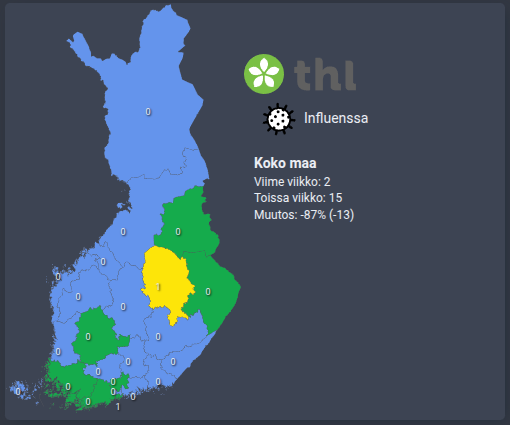

# THL card by [@jesmak](https://www.github.com/jesmak)

A Home Assistant dashboard card that draws the disease statistics of the Finnish Institute for Health and Welfare
(THL) on a map of Finland.

[![GitHub Release][releases-shield]][releases]
[![License][license-shield]](LICENSE)
[![GitHub Activity][commits-shield]][commits]

## What is it?

A custom card that shows one disease's case numbers for last week and the week before, on an interactive map of the
wellbeing services counties. Each county is coloured by how much its numbers changed, and clicking one shows its
figures beside the map.

The numbers come from the [thl](https://www.github.com/jesmak/thl) integration, which is required.



## Support

Hey dude! Help me out for a couple of :beers: or a :coffee:!

[](https://www.buymeacoffee.com/jesmak)

## How to install

### With HACS

1. Add this repository to HACS custom repositories with type **Dashboard**
2. Search for THL card in HACS and download it
3. Refresh your browser

### Manually

1. Download `thl-card.js` from the latest release and copy it to the `config/www` folder of your Home Assistant
   installation
2. In Home Assistant settings, open dashboards, click the three dots at the top right and open resources
3. Add a new resource with the path `/local/thl-card.js` and type JavaScript
4. Refresh your browser

## Options

| Name   | Type   | Requirement  | Description                             | Default |
| ------ | ------ | ------------ | --------------------------------------- | ------- |
| type   | string | **Required** | `custom:thl-card`                       |         |
| entity | string | **Required** | A disease sensor of the thl integration |         |

```yaml
type: custom:thl-card
entity: sensor.thl_influenssa
```

## The colours

A county is coloured by how its case numbers changed from the week before.

| Colour      | What it means                                        |
| ----------- | ---------------------------------------------------- |
| Blue        | No cases at all, this week or the week before        |
| Green       | Cases fell by more than 40 %                         |
| Light green | Cases fell by more than 10 %                         |
| Yellow      | Little change either way, or no week to compare with |
| Orange      | Cases rose by more than 10 %                         |
| Red         | Cases rose by more than 40 %                         |

A county the sensor carries no numbers for is left the colour of the text.

## Development

Requires Node 22.13 or newer.

```
npm install
npm run check
```

`npm run check` typechecks, lints, checks formatting, runs the tests and builds `dist/thl-card.js`, which is the file
HACS installs and is committed to the repository.

| Path                  | What it contains                                                     |
| --------------------- | -------------------------------------------------------------------- |
| `src/thl-card.ts`     | The card itself                                                      |
| `src/areas.ts`        | Reading the sensor's areas, and the colour of each county            |
| `src/map/counties.ts` | The map, generated from the original inline SVG — not edited by hand |
| `src/logos.ts`        | The THL and disease drawings                                         |
| `src/localize/`       | The card's texts                                                     |
| `tests/`              | Tests, run with vitest                                               |

## Data

Disease statistics: [THL](https://thl.fi/), through the [thl](https://www.github.com/jesmak/thl) integration.

[commits-shield]: https://img.shields.io/github/commit-activity/y/jesmak/thl-card.svg?style=for-the-badge
[commits]: https://github.com/jesmak/thl-card/commits/main
[license-shield]: https://img.shields.io/github/license/jesmak/thl-card.svg?style=for-the-badge
[releases-shield]: https://img.shields.io/github/release/jesmak/thl-card.svg?style=for-the-badge
[releases]: https://github.com/jesmak/thl-card/releases
